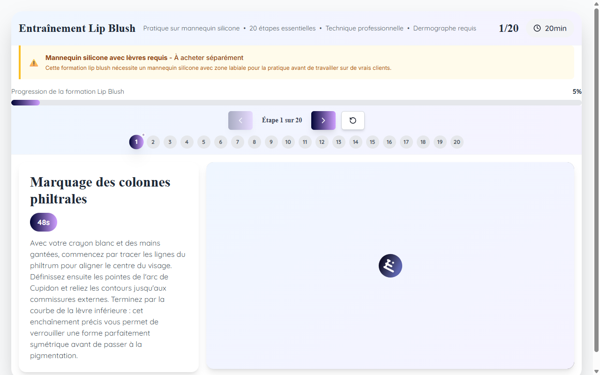

# Technique Lip Blush — Slide 7

**Course:** Lip Blush  
**Slide:** 7  
**Live URL:** https://new-lush.edtechiecorp.com  
**Stack:** Next.js · Tailwind CSS · TypeScript · GitHub Pages  

## What this slide does

Covers the core lip blush technique in the French course, walking learners through the practical pigmentation steps for creating a natural, gradient lip colour effect. At slide 7, learners are in the hands-on technique portion of the module and this content details needle movement patterns, layering depth, and how to build colour evenly across the lip border and body.

## Screenshot

## Usage

This slide is embedded as an iframe inside Coassemble at the live URL above. DNS is managed via Cloudflare (`edtechiecorp.com`). To update the slide, push to the `main` branch — GitHub Actions will rebuild and redeploy automatically.
